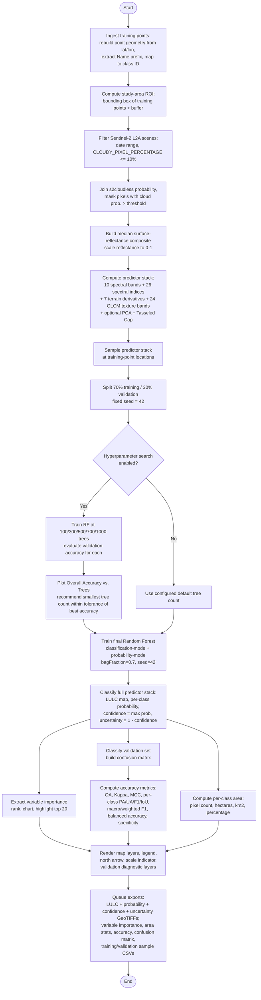

# Methodology Flowchart

Step-by-step methodology, suitable for a manuscript Methods figure.

```mermaid
flowchart TD
    S1([Start]) --> S2[Ingest training points:<br/>rebuild point geometry from lat/lon,<br/>extract Name prefix, map to class ID]
    S2 --> S3[Compute study-area ROI:<br/>bounding box of training points + buffer]
    S3 --> S4[Filter Sentinel-2 L2A scenes:<br/>date range, CLOUDY_PIXEL_PERCENTAGE <= 10%]
    S4 --> S5[Join s2cloudless probability,<br/>mask pixels with cloud prob. > threshold]
    S5 --> S6[Build median surface-reflectance composite<br/>scale reflectance to 0-1]
    S6 --> S7[Compute predictor stack:<br/>10 spectral bands + 26 spectral indices<br/>+ 7 terrain derivatives + 24 GLCM texture bands<br/>+ optional PCA + Tasseled Cap]
    S7 --> S8[Sample predictor stack<br/>at training-point locations]
    S8 --> S9[Split 70% training / 30% validation<br/>fixed seed = 42]
    S9 --> S10{Hyperparameter search<br/>enabled?}
    S10 -- Yes --> S11[Train RF at 100/300/500/700/1000 trees<br/>evaluate validation accuracy for each]
    S11 --> S12[Plot Overall Accuracy vs. Trees<br/>recommend smallest tree count within tolerance of best accuracy]
    S10 -- No --> S13[Use configured default tree count]
    S12 --> S14[Train final Random Forest<br/>classification-mode + probability-mode<br/>bagFraction=0.7, seed=42]
    S13 --> S14
    S14 --> S15[Classify full predictor stack:<br/>LULC map, per-class probability,<br/>confidence = max prob, uncertainty = 1 - confidence]
    S15 --> S16[Extract variable importance<br/>rank, chart, highlight top 20]
    S15 --> S17[Classify validation set<br/>build confusion matrix]
    S17 --> S18[Compute accuracy metrics:<br/>OA, Kappa, MCC, per-class PA/UA/F1/IoU,<br/>macro/weighted F1, balanced accuracy, specificity]
    S15 --> S19[Compute per-class area:<br/>pixel count, hectares, km2, percentage]
    S16 --> S20[Render map layers, legend,<br/>north arrow, scale indicator,<br/>validation diagnostic layers]
    S18 --> S20
    S19 --> S20
    S20 --> S21[Queue exports:<br/>LULC + probability + confidence + uncertainty GeoTIFFs;<br/>variable importance, area stats, accuracy, confusion matrix,<br/>training/validation sample CSVs]
    S21 --> S22([End])
```
