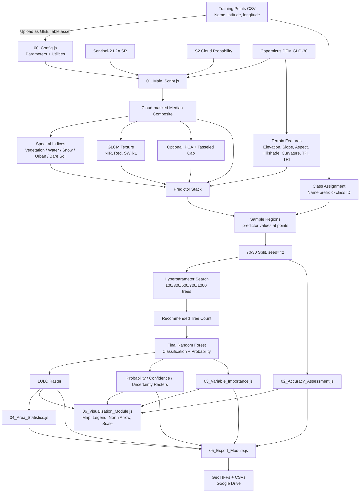

# Workflow Diagram

High-level data and process flow for the Ladakh LULC Random Forest project.
Renders as a diagram in any Mermaid-compatible viewer (GitHub, VS Code, etc.).

```mermaid
flowchart TD
    A[Training Points CSV<br/>Name, latitude, longitude] -->|Upload as GEE Table asset| B[00_Config.js<br/>Parameters + Utilities]
    C[Sentinel-2 L2A SR] --> D[01_Main_Script.js]
    E[S2 Cloud Probability] --> D
    F[Copernicus DEM GLO-30] --> D
    B --> D

    D --> G[Cloud-masked Median Composite]
    G --> H[Spectral Indices<br/>Vegetation / Water / Snow / Urban / Bare Soil]
    F --> I[Terrain Features<br/>Elevation, Slope, Aspect, Hillshade, Curvature, TPI, TRI]
    G --> J[GLCM Texture<br/>NIR, Red, SWIR1]
    G --> K[Optional: PCA + Tasseled Cap]

    H --> L[Predictor Stack]
    I --> L
    J --> L
    K --> L
    G --> L

    A --> M[Class Assignment<br/>Name prefix -> class ID]
    M --> N[Sample Regions<br/>predictor values at points]
    L --> N
    N --> O[70/30 Split, seed=42]

    O --> P[Hyperparameter Search<br/>100/300/500/700/1000 trees]
    P --> Q[Recommended Tree Count]
    Q --> R[Final Random Forest<br/>Classification + Probability]

    R --> S[LULC Raster]
    R --> T[Probability / Confidence / Uncertainty Rasters]
    R --> U[03_Variable_Importance.js]
    O --> V[02_Accuracy_Assessment.js]
    S --> W[04_Area_Statistics.js]

    S --> X[06_Visualization_Module.js<br/>Map, Legend, North Arrow, Scale]
    T --> X
    U --> X
    V --> X

    S --> Y[05_Export_Module.js]
    T --> Y
    U --> Y
    V --> Y
    W --> Y
    Y --> Z[GeoTIFFs + CSVs<br/>Google Drive]
```
